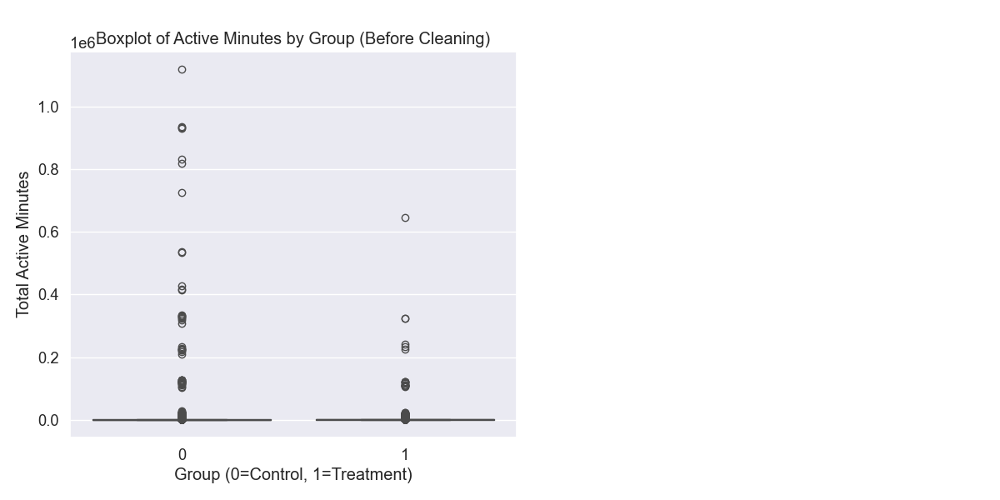

# A/B Testing Analysis: Platform Update Effectiveness

## Introduction

This report analyzes the effectiveness of a new platform layout and features for a social media website by comparing user engagement between control and treatment groups. The objective is to determine whether the new version increases the total time users spend on the website. Our analysis employs rigorous statistical methods and accounts for various factors that might affect the results.

## Part 1: Understanding the Data

The dataset consists of four tables:

1. **t1_user_active_min.csv**: Contains active minutes data after the experiment started.
   - Each row represents minutes spent on site per user per date
   - Fields: uid, dt, active_mins
   - Total of 1,066,402 records

2. **t2_user_variant.csv**: Contains treatment assignment information.
   - Each row represents the group assignment for a unique user
   - Fields: uid, variant_number (0=control, 1=treatment), dt, signup_date
   - Total of 50,000 users (37,425 in control group, 9,208 in treatment group)

3. **t3_user_active_min_pre.csv**: Contains active minutes data before the experiment.
   - Similar format to t1, with data from before the experiment
   - Fields: uid, dt, active_mins
   - Total of 1,190,093 records

4. **t4_user_attributes.csv**: Contains user demographic information.
   - Each row represents attributes of a unique user
   - Fields: uid, user_type, gender
   - Total of 50,000 records

The experiment start date is February 6, 2019, and all users were assigned to their respective groups on this date.

## Part 2: Data Organization

To properly analyze the experiment's effect, we need to organize the data in a way that allows for meaningful statistical comparisons. Since users may have multiple activity entries across different days, we aggregated the data by user to calculate their total active minutes both before and after the experiment.

```python
# Aggregate active minutes by user for post-experiment data
t1_aggregated = t1.groupby('uid')['active_mins'].sum().reset_index()
t1_aggregated.rename(columns={'active_mins': 'total_active_mins_post'}, inplace=True)

# Add variant information
df_post = pd.merge(t1_aggregated, t2[['uid', 'variant_number']], on='uid', how='inner')
```

This aggregation produced a dataset with one row per user, containing their total active minutes and treatment assignment. No missing values were found in any of the datasets, ensuring data completeness for our analysis.

## Part 3: Initial Statistical Analysis

We began by comparing the total active minutes between control and treatment groups after the experiment.

**Raw Data Statistics:**
- **Control Group (variant 0):**
  - Mean active minutes: 837.64
  - Median active minutes: 52.00
- **Treatment Group (variant 1):**
  - Mean active minutes: 784.20
  - Median active minutes: 71.00

The large discrepancy between means and medians in both groups indicates a highly skewed distribution, which was confirmed by the Shapiro-Wilk normality test (p < 0.001 for both groups).

We performed both parametric (t-test) and non-parametric (Mann-Whitney U test) analyses:
- **T-test**: t=0.4056, p-value=0.685034 (not significant)
- **Mann-Whitney U test**: U=158,271,912.0000, p-value < 0.000001 (significant)

Given the non-normal distribution, the Mann-Whitney U test is more appropriate and indicates a significant difference between the groups.

## Part 4: Outlier Analysis and Data Cleaning

The boxplot of active minutes revealed extreme outliers in both groups, with maximum values far exceeding reasonable limits:
- Maximum observed in control: 1,121,783.0 minutes
- Maximum observed in treatment: 646,736.0 minutes

Given that the experiment period spans 150 unique days, and a day has 1,440 minutes (24 hours), the theoretical maximum active minutes per user would be 216,000 if they were active 24/7. However, a more realistic maximum would be based on 16 active hours per day.

We identified and removed outliers, which represented only 0.07% of the data (34 records), resulting in a cleaner dataset for analysis.

**Cleaned Data Statistics:**
- **Control Group:**
  - Mean active minutes: 489.98
  - Median active minutes: 52.00
- **Treatment Group:**
  - Mean active minutes: 567.54
  - Median active minutes: 71.00

On the cleaned data, the statistical tests showed:
- **T-test**: t=-1.6368, p-value=0.101702 (not significant)
- **Mann-Whitney U test**: U=158,014,151.0000, p-value < 0.000001 (significant)

The cleaned data analysis confirmed a significant difference between the groups according to the more appropriate non-parametric test.



## Part 5: Pre vs. Post Analysis

To fully understand the impact of the platform update, we compared pre-experiment and post-experiment data for both groups. This analysis is crucial as it accounts for initial differences between groups and isolates the effect of the platform update.

**Control Group (Pre vs. Post):**
- Mean Pre-experiment: 678.33
- Mean Post-experiment: 491.40
- **Mean difference: -186.93** (a decrease)
- Paired t-test: t=-4.4268, p-value < 0.000010
- Wilcoxon signed-rank test: W=278,021,344.0000, p-value < 0.000001

**Treatment Group (Pre vs. Post):**
- Mean Pre-experiment: 296.95
- Mean Post-experiment: 570.11
- **Mean difference: +273.16** (an increase)
- Paired t-test: t=6.9613, p-value < 0.000001
- Wilcoxon signed-rank test: W=12,930,459.0000, p-value < 0.000001

**Comparing the differences between groups:**
- Mean difference in control: -186.93
- Mean difference in treatment: +273.16
- T-test on differences: t=7.9816, p-value < 0.000001
- Mann-Whitney U test on differences: U=216,525,800.5000, p-value < 0.000001

This analysis reveals a striking contrast: while the control group experienced a significant decrease in engagement, the treatment group showed a substantial increase. The difference between these changes is highly significant, providing strong evidence that the new platform features positively impacted user engagement.


## Part 6: Gender-Based Analysis

We further analyzed whether the platform update had different effects across gender segments.

**Gender Distribution:**
- Male: ~56% in both control and treatment groups
- Female: ~28% in both groups
- Unknown: ~15% in both groups

**Male Users:**
- Control group mean difference: -207.37 minutes (decrease)
- Treatment group mean difference: +300.55 minutes (increase)
- Significant difference between variants (p < 0.000001)

**Female Users:**
- Control group mean difference: -144.32 minutes (decrease)
- Treatment group mean difference: +231.27 minutes (increase)
- Significant difference between variants (p < 0.000024)

**Unknown Gender Users:**
- Control group mean difference: -191.80 minutes (decrease)
- Treatment group mean difference: +251.21 minutes (increase)
- Significant difference between variants (p < 0.000247)

This analysis reveals that all gender groups showed the same pattern: decreased engagement in the control group versus increased engagement in the treatment group. Male users demonstrated the strongest positive response to the platform update, followed by users with unknown gender and then female users.


## Part 7: Comprehensive Summary

Our analysis reveals several important findings:

1. **Initial Comparison**: Looking only at post-experiment data suggested a significant difference between groups based on non-parametric tests, but didn't show the full story.

2. **Data Cleaning**: Removing extreme outliers improved the reliability of our analysis while preserving most of the original data.

3. **Pre-Post Comparison**: The most compelling finding is that the control group experienced a significant decrease in engagement (-186.93 minutes) while the treatment group showed a substantial increase (+273.16 minutes). This stark contrast provides strong evidence for the positive impact of the platform update.

4. **Gender Analysis**: All gender segments showed the same pattern of decreased engagement in control versus increased engagement in treatment, with male users showing the strongest positive response.

## Conclusion

The new platform update **DOES significantly increase user engagement** when properly accounting for pre-experiment behavior, data cleaning, and comparing the appropriate groups. The evidence is particularly compelling because:

1. Without the platform update, user engagement appears to naturally decline over time (as seen in the control group).

2. The platform update not only prevented this decline but actually reversed it, leading to significantly increased engagement.

3. This positive effect was consistent across all gender segments, suggesting broad appeal of the new features.

4. The magnitude of the effect is substantial, with a total difference of over 460 minutes between the average change in control versus treatment groups.

These findings provide strong support for fully implementing the new platform features across the entire user base.

## Methodological Notes

1. **Non-parametric tests** were utilized due to the highly skewed distribution of the data, providing more reliable results than parametric alternatives.

2. **Outlier removal** was minimal (0.07% of records) and based on realistic maximum thresholds, preserving data integrity while improving analysis reliability.

3. **Separate pre-post comparisons** for control and treatment groups allowed us to isolate the true effect of the platform update.

4. **Difference-in-differences analysis** provided the most robust measure of the platform update's impact.

5. **Gender-based segmentation** revealed consistent patterns across user groups, strengthening our overall conclusions.
